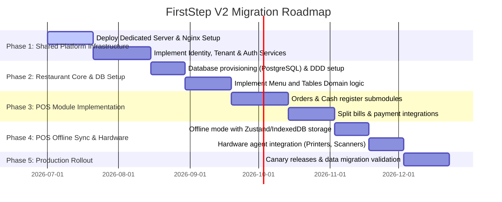
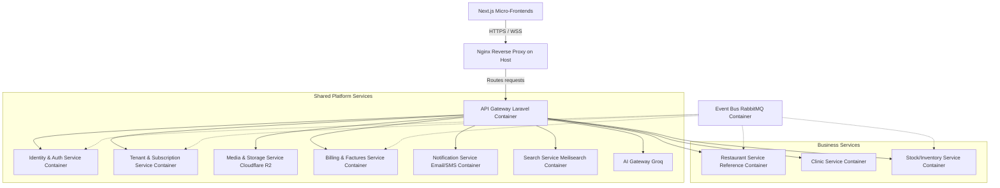
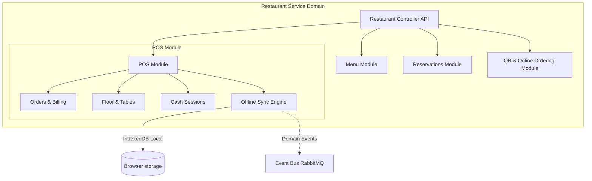
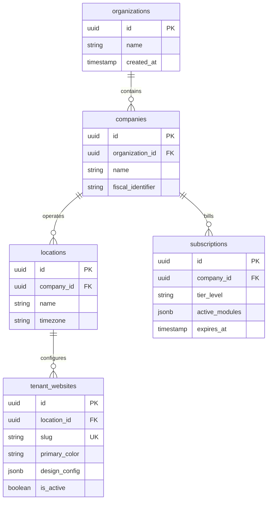
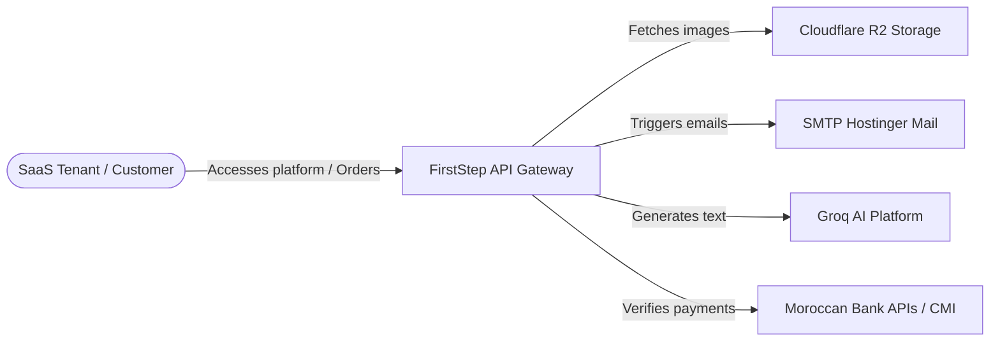
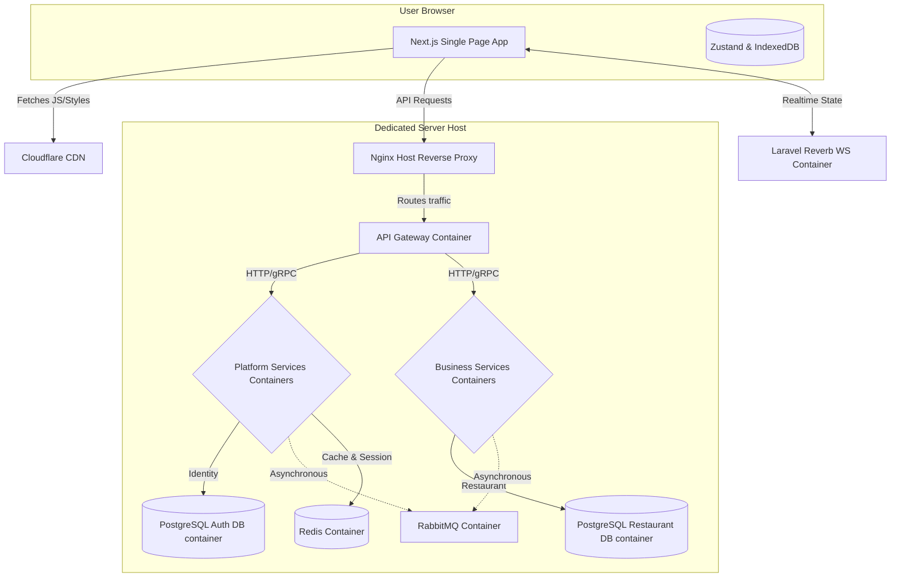
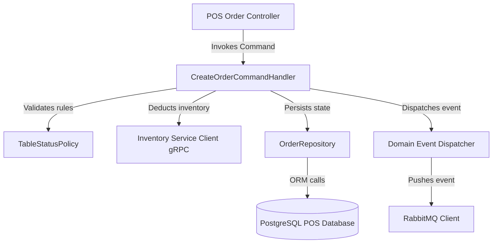

# FIRSTSTEP V2 - ENTERPRISE SaaS ARCHITECTURE DOCUMENTATION
**Status**: DRAFT FOR ARCHITECTURE REVIEW  
**Author**: Chief Software Architect, FirstStep  
**Target Stack**: Next.js (TypeScript) + Laravel 12 (PHP 8.4) + PostgreSQL + RabbitMQ/Redis + Dedicated Server Hosting (Nginx + Docker Compose)

---

## 1. Executive Summary

FirstStep is transitioning from a Next.js-centric monolith using SQLite to a highly scalable, multi-tenant enterprise **Business Operating System** (SaaS). Inspired by enterprise platforms like Shopify, Toast POS, and Salesforce, FirstStep V2 separates platform logic from business domain logic.

The architecture is redesigned around **Microservices**, utilizing **Domain-Driven Design (DDD)**, strict **Data Isolation**, and a **Module Registry** that allows tenants to dynamically enable or disable modules and submodules down to individual feature flags.

The initial implementation focuses on the **Restaurant Service** (with the POS Module as a reference core), which establishes the patterns, code structures, and communication contracts for all future services (Hotel, Clinic, Stock, CRM, etc.).

Rather than using complex cloud-native orchestrators like Kubernetes, the infrastructure is designed to run efficiently on a high-performance **Dedicated Server** utilizing **Nginx** as a reverse proxy, **Certbot** for Let's Encrypt SSL, and **Docker Compose** for container orchestration.

---

## 2. Architecture Vision

The core architectural principles of FirstStep V2 are:
1. **Strict Service Independence**: No microservice may share a database with another. Cross-service data dependencies are resolved via asynchronous event-driven synchronization or synchronous gRPC/REST APIs.
2. **Dynamic Tenant Modularity**: Tenants can customize their workspace from a platform-wide Module Registry. The system dynamically adjusts database migrations, permissions, and frontend routes based on tenant subscription tiers.
3. **Enterprise Multi-Tenancy**: Data isolation supports complex hierarchical org structures: `Organization -> Company -> Branch -> Location -> Workspace`.
4. **Resiliency & Performance**: Write locks are eliminated by migrating from SQLite to dedicated PostgreSQL instances. Event-driven queue pipelines (RabbitMQ + Redis) process heavy workloads (such as invoice generation and campaign emails) asynchronously.
5. **Universal Design System**: A unified design language across all micro-frontends built with Next.js, Zustand, TanStack Query, and shadcn/ui.
6. **Simplicity of Operations**: Deploying to a bare-metal dedicated server minimizes cost and networking complexity while providing predictable, raw physical performance.

---

## 3. Current vs. Target Architecture

| Component / Layer | Current Monolithic Architecture (V1) | Target Enterprise Microservices (V2) |
| :--- | :--- | :--- |
| **Framework / Runtime** | Next.js 16 (App Router + Server Actions) | Next.js (Frontend) + Laravel 12 / PHP 8.4 (Backend Services) |
| **Database Engine** | Single SQLite file (`dev.db`) with fallback | Database per Microservice (PostgreSQL) |
| **Communication** | Direct Prisma calls & local Server Actions | Async Event Bus (RabbitMQ) & Sync APIs (gRPC/REST) |
| **Authentication** | Custom cookie-based session token containing user CUID | Stateless signed JWTs with OAuth2, 2FA, and Passkeys |
| **State Management** | React Context (`CartContext`) & local hooks | Zustand (Client State) + TanStack Query (Server State) |
| **Queue / Asynchrony** | Synchronous loops (blocks during HTTP request) | Redis Queues (short jobs) & RabbitMQ (cross-service events) |
| **Deployment** | Direct Vercel / single Docker container | Dedicated Server (Nginx Host + Docker Compose) |
| **Observability** | Console logs / serverless execution logs | Prometheus + Grafana (Metrics), Loki (Logs), OpenTelemetry |
| **Infrastructure** | Manual provisioning / Git triggers | Infrastructure as Code (IaC) via Terraform (VPS/Dedicated Providers) |

### Migration Strategy

We will proceed in five phases to ensure zero downtime and maintain parity with existing business logic:



---

## 4. Platform & Service Catalog

The V2 ecosystem divides tasks into **Shared Platform Services** and independent **Business Services**.



### Shared Platform Services Catalog
1. **Identity & Authorization Service**: Manages accounts, signed JWT token generation, OAuth2 providers, Passkeys, 2FA validation, and RBAC/PBAC security policy evaluations.
2. **Tenant Service**: Manages customer organization directories, location setups, configuration details, and custom domains.
3. **Subscription Service**: Manages plans, features maps, and controls the Module Registry activation states per tenant.
4. **Billing Service**: Generates SaaS invoices (Factures) using `pdf-lib` overlays. Integrates with payment providers.
5. **Notification Service**: Dispatches transactional alerts via SMTP, SMS providers, or WebSocket channels.
6. **Media Service**: Manages Cloudflare R2 uploads, CDN caching, and image optimization.
7. **Search Service**: Synchronizes searchable business items into Meilisearch indexes.
8. **AI Gateway**: Standardizes LLM prompts (via Groq), implements query caching, rate-limits API keys, and tracks token consumption.

---

## 5. Restaurant Service Deep Dive

The **Restaurant Service** acts as our reference architecture. It is built as a modular application in Laravel 12 using Domain-Driven Design (DDD).



### Module Registry & Feature Flags
Each tenant has a custom dashboard powered by feature flags. The database model enforces subscription levels before enabling modules:

```json
{
  "tenant_id": "tenant_xyz",
  "active_modules": [
    {
      "module_id": "restaurant_pos",
      "version": "2.1.0",
      "features": {
        "split_bills": true,
        "tips": false,
        "offline_mode": true,
        "hardware_printing": true
      }
    },
    {
      "module_id": "restaurant_qr_ordering",
      "version": "1.0.4",
      "features": {
        "digital_menu": true,
        "cart_checkout": true
      }
    }
  ]
}
```

---

## 6. Database Diagrams (ERD)

Each microservice owns its schema. Below are the core relational database models for the **Tenant Service** and the **Restaurant POS Service** in PostgreSQL.

### Tenant Service Schema


### Restaurant POS Schema
```mermaid
erDiagram
    tables ||--o{ orders : accommodates
    orders ||--o{ order_items : contains
    cash_sessions ||--o{ orders : aggregates
    waiters ||--o{ tables : serves

    tables {
        uuid id PK
        uuid tenant_id
        string number
        integer capacity
        boolean is_active
    }
    waiters {
        uuid id PK
        uuid tenant_id
        string name
        string pin_hash
        boolean is_active
    }
    cash_sessions {
        uuid id PK
        uuid tenant_id
        uuid opened_by
        double precision opening_balance
        double precision closing_balance
        string status
        timestamp opened_at
        timestamp closed_at
    }
    orders {
        uuid id PK
        uuid tenant_id
        uuid table_id FK
        uuid cash_session_id FK
        string status
        double precision subtotal
        double precision tax_amount
        double precision total_amount
        timestamp created_at
    }
    order_items {
        uuid id PK
        uuid order_id FK
        uuid dish_id
        string name
        double precision unit_price
        integer quantity
        jsonb modifiers
    }
```

---

## 7. Event Catalog & Queue Architecture

To maintain loose coupling, microservices communicate asynchronously using **RabbitMQ** for integration events, and **Redis** for lightweight, localized job queues.

### Event Catalog
1. **TenantCreatedEvent** (`tenant.domain.events`)
   - *Publisher*: Tenant Service
   - *Subscribers*: Restaurant Service (creates default configurations), Billing Service (initializes customer record).
2. **OrderPaidEvent** (`restaurant.pos.events`)
   - *Publisher*: Restaurant Service (POS Module)
   - *Subscribers*: Billing Service (issues tax invoice PDF), Inventory Service (deducts ingredients).
3. **AppointmentScheduledEvent** (`clinic.domain.events`)
   - *Publisher*: Clinic Service
   - *Subscribers*: Notification Service (sends confirmation SMS/Email).
4. **CampaignTriggeredEvent** (`marketing.campaigns.events`)
   - *Publisher*: Campaign Service
   - *Subscribers*: Notification Service (triggers Nodemailer worker loops).

### Queue Design
- **RabbitMQ Broker**: Handles durable, multi-subscriber integration events.
- **Redis Queue (Laravel Horizon)**: Handles tenant-level background tasks, such as generating invoice PDFs or processing image uploads.

```
[Server Action / API Call]
         │
         ▼
[Laravel Job Dispatcher]
         │
   ┌─────┴────────────────────────┐
   ▼                              ▼
(Redis - Horizon)          (RabbitMQ Event Bus)
   │                              │
   ├─► PDF Invoices               ├─► Sync Inventory
   ├─► SMTP Emails                ├─► Sync Search Index
   └─► Image Resizing             └─► Audit Logs
```

---

## 8. C4 Diagram Specifications

### C4 Level 1: System Context Diagram
Shows how users interact with FirstStep and its relationships with external dependencies.



### C4 Level 2: Container Diagram (Dedicated Server Layout)
Details the core deployment runtimes of the FirstStep V2 ecosystem on the dedicated server host.



### C4 Level 3: Component Diagram (Restaurant POS Module)
Drills down into the Restaurant POS Laravel module structure.



---

## 9. Folder Structures & Conventions

### Frontend Folder Structure (Next.js Feature-Based Architecture)
The frontend relies on dynamic folder organization matching domain features rather than standard technical groupings (e.g. putting views, assets, and tests of a single domain together).

```
firststep-frontend/
├── src/
│   ├── app/                    # Next.js App Router root pages
│   │   ├── (auth)/             # Authentication route groups
│   │   ├── (dashboard)/        # Tenant workspace routes
│   │   └── [tenantSlug]/       # Public dynamic guest domains
│   ├── components/
│   │   ├── ui/                 # Reusable shadcn component atoms
│   │   └── shared/             # Shared layout grids
│   ├── features/               # High-level domain modules
│   │   ├── restaurant-pos/     # POS Feature Folder
│   │   │   ├── components/     # POS specific views (FloorPlan, CashDrawer)
│   │   │   ├── hooks/          # useOfflineOrders, useReceiptPrinter
│   │   │   ├── store/          # Zustand POS State stores (offline sync)
│   │   │   ├── services/       # Client API calls (gRPC/REST)
│   │   │   └── types.ts        # TS interface definitions
│   │   └── clinic-calendar/    # Clinic Feature Folder
│   ├── lib/
│   │   ├── api-client.ts       # Axios wrapper with refresh-token checks
│   │   └── utils.ts            # Utility functions
```

### Backend Folder Structure (Laravel 12 Domain-Driven Design)
The backend follows Clean Architecture and organizes files by Domain and Infrastructure contexts inside Laravel directories.

```
firststep-backend/
├── app/
│   ├── Domains/                 # Domain Driven modules
│   │   └── Restaurant/          # Restaurant Domain
│   │       ├── Models/          # Eloquent entities (Dish, Table, Waiter)
│   │       ├── Contracts/       # Repository and service interfaces
│   │       ├── Repositories/    # Database queries isolation
│   │       ├── Actions/         # Business domain use-cases (CreateOrderAction)
│   │       ├── Events/          # Event declarations (OrderPaidEvent)
│   │       └── Policies/        # RBAC validation checks
│   ├── Http/
│   │   ├── Controllers/         # Low-level framework adapters (REST endpoints)
│   │   ├── Middleware/          # Tenant resolver, Auth validation
│   │   └── Resources/           # API response transformations (DTO mappings)
│   └── Infrastructure/          # Platform level adapters
│       ├── EventBus/            # RabbitMQ publishers/listeners
│       ├── Storage/             # Cloudflare R2 configurations
│       └── PDF/                 # pdf-lib integration scripts
```

### Coding Standards & Naming Conventions
1. **PHP/Laravel**:
   - Strict typing enabled (`declare(strict_types=1);` at the top of every file).
   - PSR-12 coding style compliance.
   - Use Repository pattern for database access instead of direct model queries in controllers.
   - Database columns and tables must use `snake_case`.
2. **TypeScript/React**:
   - Use functional components. Define return types explicitly.
   - Prefer custom hooks (`useFeature`) over inline logic.
   - Maintain strict folder organization in the `features/` directory.

---

## 10. API Specifications

All REST interfaces follow standard structures with explicit JSON payload wrappers. Below is the REST schema for POS operations.

### POST `/api/v1/pos/orders` (Create POS Order)

**Request Headers**:
```http
Authorization: Bearer <JWT_TOKEN>
X-Tenant-ID: <TENANT_UUID>
X-Location-ID: <LOCATION_UUID>
Content-Type: application/json
```

**Request Body**:
```json
{
  "table_id": "cuid-or-uuid-for-table",
  "cash_session_id": "cuid-or-uuid-for-cash-session",
  "items": [
    {
      "dish_id": "dish-uuid",
      "quantity": 2,
      "selected_options": [
        {
          "option_id": "spiciness",
          "value": "medium"
        }
      ],
      "selected_addons": ["extra-cheese-id"]
    }
  ]
}
```

**Response (201 Created)**:
```json
{
  "success": true,
  "data": {
    "order_id": "order-uuid",
    "status": "PENDING",
    "subtotal": 120.00,
    "tax_amount": 24.00,
    "total_amount": 144.00,
    "created_at": "2026-06-26T21:05:00Z"
  }
}
```

---

## 11. Infrastructure & Deployment (Dedicated Server Architecture)

FirstStep V2 is deployed on a dedicated high-performance bare-metal server (e.g. Hetzner, OVH, or Scaleway) using Docker Compose for local service orchestration.

### Nginx Host Configurations
An Nginx server running directly on the host acts as the entry-point. It acts as a reverse proxy, manages SSL handshakes (Certbot / Let's Encrypt), limits request rates, and routes connections to internal containers.

```nginx
# /etc/nginx/sites-available/firststep
server {
    listen 80;
    listen [::]:80;
    server_name .firststepco.com;
    return 301 https://$host$request_uri;
}

server {
    listen 443 ssl http2;
    listen [::]:443 ssl http2;
    server_name .firststepco.com;

    ssl_certificate /etc/letsencrypt/live/firststepco.com/fullchain.pem;
    ssl_certificate_key /etc/letsencrypt/live/firststepco.com/privkey.pem;
    
    # Rate Limiting
    limit_req zone=api_limit burst=20 nodelay;

    # Frontend Routing (NextJS SPA)
    location / {
        proxy_pass http://127.0.0.1:3000;
        proxy_http_version 1.1;
        proxy_set_header Upgrade $http_upgrade;
        proxy_set_header Connection 'upgrade';
        proxy_set_header Host $host;
        proxy_cache_bypass $http_upgrade;
    }

    # Backend API Routing (Laravel Gateway)
    location /api/ {
        proxy_pass http://127.0.0.1:8000;
        proxy_set_header Host $host;
        proxy_set_header X-Real-IP $remote_addr;
        proxy_set_header X-Forwarded-For $proxy_add_x_forwarded_for;
        proxy_set_header X-Forwarded-Proto $scheme;
    }

    # Laravel Reverb WebSocket Routing
    location /app/ {
        proxy_pass http://127.0.0.1:8080;
        proxy_http_version 1.1;
        proxy_set_header Upgrade $http_upgrade;
        proxy_set_header Connection "Upgrade";
        proxy_set_header Host $host;
    }
}
```

### Docker Compose Orchestration Setup
A single parent `docker-compose.yml` configures service boundaries, volume mapping for databases, and sets appropriate CPU/Memory limits.

```yaml
version: '3.8'

services:
  firststep-gateway:
    build:
      context: ./gateway
      dockerfile: Dockerfile.prod
    container_name: firststep-gateway
    restart: always
    ports:
      - "8000:80"
    environment:
      - NODE_ENV=production
    depends_on:
      - redis
      - db-auth

  firststep-restaurant:
    build:
      context: ./services/restaurant
      dockerfile: Dockerfile
    container_name: firststep-restaurant
    restart: always
    environment:
      - DB_HOST=db-restaurant
    volumes:
      - ./uploads:/var/www/html/storage/app/public
    depends_on:
      - db-restaurant

  db-auth:
    image: postgres:15-alpine
    container_name: db-auth
    restart: always
    volumes:
      - pgdata-auth:/var/lib/postgresql/data
    environment:
      - POSTGRES_DB=firststep_auth
      - POSTGRES_USER=fs_admin
      - POSTGRES_PASSWORD_FILE=/run/secrets/db_password

  db-restaurant:
    image: postgres:15-alpine
    container_name: db-restaurant
    restart: always
    volumes:
      - pgdata-restaurant:/var/lib/postgresql/data
    environment:
      - POSTGRES_DB=firststep_restaurant
      - POSTGRES_USER=fs_admin
      - POSTGRES_PASSWORD_FILE=/run/secrets/db_password

  redis:
    image: redis:7-alpine
    container_name: redis-cache
    restart: always
    command: redis-server --save 60 1 --loglevel warning
    volumes:
      - redisdata:/data

  rabbitmq:
    image: rabbitmq:3-management-alpine
    container_name: event-broker
    restart: always
    ports:
      - "5672:5672"
      - "15672:15672"
    volumes:
      - rabbitdata:/var/lib/rabbitmq

volumes:
  pgdata-auth:
  pgdata-restaurant:
  redisdata:
  rabbitdata:
```

### CI/CD Deployment Flow (GitHub Actions to Dedicated Server)
```
[Git Push Main] 
   │
   ▼
[Security Lint & Tests] (ESLint, PHPUnit, Static checking)
   │
   ▼
[Build Docker Images] (Build multi-stage production runner files)
   │
   ▼
[Push to Container Registry] (GitHub Packages or Docker Hub)
   │
   ▼
[Trigger Deployment SSH Script] (SSH into Dedicated Server, pull images, run migrations, and execute `docker compose up -d`)
```

---

## 12. Observability & Monitoring

We use the **LGTM** (Loki, Grafana, Tempo, Mimir) stack along with Prometheus running directly on the dedicated host to monitor system health:
1. **Metrics (Prometheus & Grafana)**:
   - Scraping runtime health data (e.g. CPU/Memory usage, disk IO, PostgreSQL stats, Laravel Horizon queues).
2. **Logs (Loki)**:
   - Docker container log driver redirects all log lines directly to a Loki instance.
3. **Tracing (OpenTelemetry)**:
   - Traces requests across microservices (Next.js -> API Gateway -> Restaurant Service -> Inventory Service) to identify performance bottlenecks.

---

## 13. Security Architecture

Our security model follows OWASP Top 10 guidelines:
1. **Data Isolation**: 
   - Every database query includes a `tenant_id` check. 
   - Row-Level Security (RLS) is enabled on all tables in PostgreSQL.
2. **API Gateways & Rate Limiting**:
   - Nginx handles rate limiting at the host layer before requests reach Docker containers.
   - Validates JWT signatures at the Laravel API Gateway before forwarding requests.
3. **Audit Log System**:
   - Every critical event (e.g. manual payment verification, changes to client records, menu modifications) publishes an `AuditEvent` to a read-only audit database.
4. **Secrets Management**:
   - Docker secrets (`/run/secrets/*`) are mounted into containers at runtime rather than putting plaintext environment keys in the docker-compose file.

---

## 14. Scalability, Disaster Recovery, and Expansion

- **Scalability Strategy**:
  - **Vertical Scaling**: Utilizing powerful bare-metal machines (e.g. 64-128 GB RAM, 16-32 Cores) allows the system to easily handle hundreds of thousands of active users without network overhead.
  - **Database Optimization**: PostgreSQL connections pool via `PgBouncer` to handle high transaction throughput.
- **Disaster Recovery (DR)**:
  - Daily cron scripts backup all PostgreSQL volumes, encrypt them, and push them to a secure Cloudflare R2 bucket.
  - Target Recovery Point Objective (RPO) is 1 hour; Target Recovery Time Objective (RTO) is 2 hours (using backup image restores on a fresh standby machine).
- **Future Expansion Strategy**:
  - New business services (like Hotel or Clinic Services) can be deployed by adding them as service blocks in the parent `docker-compose.yml` file.

---
*End of Target Architecture and Redesign Specification Document.*
