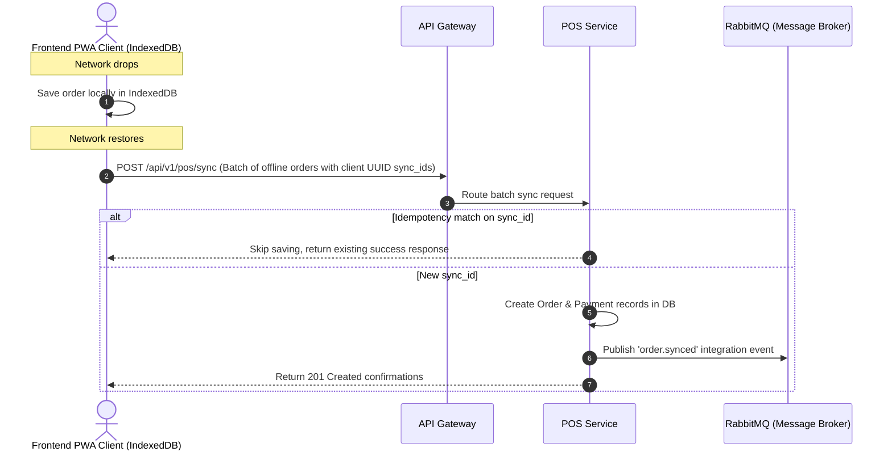

# Phase 3: POS Module Implementation Plan

This document outlines the detailed step-by-step implementation plan for **Phase 3** of the FirstStep V2 enterprise migration. Phase 3 focuses on creating the **POS (Point of Sale) Service** using Laravel 12, defining its PostgreSQL schemas, laying out its Domain-Driven Design (DDD) boundaries, structuring the offline-first synchronization strategy, and configuring its integration API routes.

---

## 1. Directory Structure

We will bootstrap the `services/pos/` microservice and align it with a DDD domain-focused layout.

```
D:/firststep/
├── services/
│   └── pos/                    # POS Service (Laravel 12)
│       ├── app/
│       │   ├── Domains/        # DDD Domain Entities & Actions
│       │   │   └── POS/
│       │   │       ├── Models/        # Eloquent Models (Register, Session, Order, Payment)
│       │   │       ├── Repositories/  # Data Access Layers
│       │   │       └── Actions/       # Core Use Cases (ManageSessions, SyncOrders)
│       │   └── Http/
│       │       ├── Controllers/       # REST API Endpoints
│       │       └── Middleware/        # Tenant & Session Validation Checks
│       └── database/migrations/       # Database Migration Scripts
```

---

## 2. Docker Compose Integration

We will add the POS Service database (`db-pos`) and application service container (`pos-service`) to our root [docker-compose.yml](file:///D:/firststep/docker-compose.yml) configuration.

```yaml
  # POS Service Container
  pos-service:
    build:
      context: ./services/pos
      dockerfile: Dockerfile
    container_name: firststep-pos
    restart: always
    environment:
      - APP_ENV=production
      - DB_CONNECTION=pgsql
      - DB_HOST=db-pos
      - DB_PORT=5432
      - DB_DATABASE=firststep_pos
      - DB_USERNAME=fs_admin
      - DB_PASSWORD_FILE=/run/secrets/db_password
    secrets:
      - db_password
    depends_on:
      - db-pos
    networks:
      - firststep-network

  # Database: POS Service PostgreSQL
  db-pos:
    image: postgres:15-alpine
    container_name: db-pos
    restart: always
    volumes:
      - pgdata-pos:/var/lib/postgresql/data
    environment:
      - POSTGRES_DB=firststep_pos
      - POSTGRES_USER=fs_admin
      - POSTGRES_PASSWORD_FILE=/run/secrets/db_password
    secrets:
      - db_password
    networks:
      - firststep-network
```

We will also append `pgdata-pos:` under the global `volumes` block at the bottom of the compose file.

---

## 3. Database Migration Schemas

Located inside `services/pos/database/migrations/`:

```php
// Migration for POS Registers and Cashier Sessions
Schema::create('pos_registers', function (Blueprint $table) {
    $table->uuid('id')->primary();
    $table->uuid('tenant_id')->index(); // Tenant website isolation key
    $table->uuid('location_id')->index(); // Location reference
    $table->string('name');
    $table->string('device_identifier')->unique(); // Unique hardware ID or UUID
    $table->boolean('is_active')->default(true);
    $table->timestamps();
});

Schema::create('pos_sessions', function (Blueprint $table) {
    $table->uuid('id')->primary();
    $table->uuid('register_id');
    $table->uuid('cashier_id'); // Cashier user UUID reference
    $table->double('opening_float'); // Starting cash balance (MAD)
    $table->double('closing_float')->nullable(); // Expected closing cash balance
    $table->double('actual_cash_counted')->nullable(); // Actual cash counted on close
    $table->string('status')->default('open'); // open, closed, auditing
    $table->text('notes')->nullable();
    $table->timestamp('opened_at');
    $table->timestamp('closed_at')->nullable();
    $table->timestamps();

    $table->foreign('register_id')->references('id')->on('pos_registers');
});

// Migration for POS Orders and Payments
Schema::create('pos_orders', function (Blueprint $table) {
    $table->uuid('id')->primary();
    $table->uuid('session_id');
    $table->uuid('tenant_id')->index();
    $table->string('order_number'); // Human-readable incremental receipt ID (e.g. REG1-0043)
    $table->uuid('sync_id')->nullable()->unique(); // Client-side generated UUID for offline sync idempotency
    $table->double('subtotal');
    $table->double('discount')->default(0.00);
    $table->double('tax')->default(0.00);
    $table->double('total');
    $table->string('status')->default('completed'); // pending, completed, cancelled, refunded
    $table->jsonb('items'); // Snapshotted items (dish name, price, modifications) to protect history
    $table->timestamps();

    $table->foreign('session_id')->references('id')->on('pos_sessions');
});

Schema::create('pos_payments', function (Blueprint $table) {
    $table->uuid('id')->primary();
    $table->uuid('order_id');
    $table->string('method'); // cash, card, mobile, loyalty
    $table->double('amount');
    $table->jsonb('metadata')->nullable(); // Card transaction details, terminal response logs
    $table->timestamps();

    $table->foreign('order_id')->references('id')->on('pos_orders')->onDelete('cascade');
});
```

---

## 4. DDD Domain Design

### A. Repository Contracts (Contracts Layer)
Secures high-speed data access.

```php
namespace App\Domains\POS\Contracts;

interface OrderRepositoryInterface
{
    public function findBySyncId(string $syncId);
    public function save(array $data);
    public function getSessionTotalSales(string $sessionId);
}
```

### B. Core Actions (Application Layer)
Manages cash sessions and offline order synchronizations.

```php
namespace App\Domains\POS\Actions;

use App\Domains\POS\Contracts\OrderRepositoryInterface;

class SyncOfflineOrderAction
{
    protected $orderRepository;

    public function __construct(OrderRepositoryInterface $orderRepository)
    {
        $this->orderRepository = $orderRepository;
    }

    public function execute(string $sessionId, array $orderData)
    {
        // 1. Idempotency Check: Prevent duplicate syncs
        if (isset($orderData['sync_id'])) {
            $existing = $this->orderRepository->findBySyncId($orderData['sync_id']);
            if ($existing) {
                return $existing; // Already synced, return existing order record
            }
        }

        // 2. Business Validation: Ensure session is active
        // (Resolves cashier context and validates session_id state)

        // 3. Process and Save snapshotted order structure
        return $this->orderRepository->save(array_merge($orderData, [
            'session_id' => $sessionId,
            'status' => 'completed'
        ]));
    }
}
```

---

## 5. API Routes

Located inside `services/pos/routes/api.php`:

```php
use Illuminate\Support\Facades\Route;
use App\Http\Controllers\RegisterController;
use App\Http\Controllers\SessionController;
use App\Http\Controllers\OrderController;

Route::prefix('v1/pos')->group(function () {
    // Register Configuration
    Route::get('/registers', [RegisterController::class, 'index']);
    
    // Session Controls (Cash audits)
    Route::post('/sessions/open', [SessionController::class, 'open']);
    Route::post('/sessions/{id}/close', [SessionController::class, 'close']);
    
    // Order & Sync Pipelines
    Route::post('/orders', [OrderController::class, 'store']);
    Route::post('/sync', [OrderController::class, 'syncBatch']); // Offline batch sync endpoint
});
```

---

## 6. Offline Synchronization Flow

For POS systems, network drops are fatal. The platform uses an **offline-first local synchronization flow**:



---

## 7. Integration Events (RabbitMQ Integration)

When a POS cashier session is closed, or a synchronized order is paid, the POS Service publishes events to other microservices (e.g. accounting, analytics, inventory):

### Example Payload: `POSSessionClosedEvent`
- **Exchange**: `pos.sessions.exchange`
- **Routing Key**: `session.closed`
- **Body**:
  ```json
  {
    "event_id": "uuid-for-event",
    "event_type": "POS_SESSION_CLOSED",
    "timestamp": "2026-06-27T16:00:00Z",
    "data": {
      "tenant_id": "tenant-uuid",
      "session_id": "session-uuid",
      "cashier_id": "cashier-uuid",
      "expected_cash": 1250.00,
      "actual_cash": 1245.00,
      "difference": -5.00,
      "total_card_sales": 870.00,
      "closed_at": "2026-06-27T15:58:30Z"
    }
  }
  ```

---
*End of Phase 3 Implementation Plan.*
